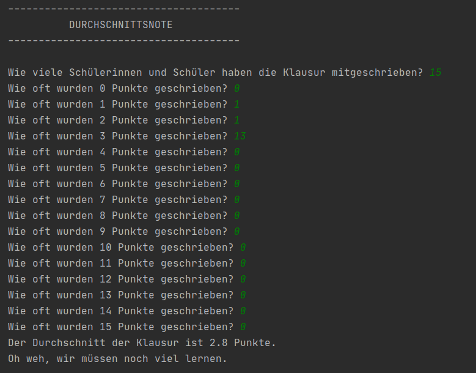

# Notendurchschnitt

So soll das fertige Programm aussehen:

Der **weiße** Text ist die Ausgabe des Programms. Der **grüne** Text wird vom Benutzer eingegeben.

## Aufgabenstellung:

* Das Programm soll den User fragen, wie viele SuS die Informatikklausur geschrieben haben.
* Das Programm soll fragen, wie viele SuS 0 Punkte, 01 Punkt, 02 Punkte .... 15 Punkte geschrieben haben.
* Auf dieser Grundlage soll das Programm den Notendurchschnitt der Informatikklausur berechnen.
* Das Programm soll den Notendurchschnitt der Klausur ausgeben,
* Wenn der Notendurchschnitt unter 5 Punkten liegt, soll das Programm die Meldung: “Oh weh, wir müssen noch viel lernen” ausgeben.
* Wenn der Notendurchschnitt zwischen 5 und 7 Punkten liegt soll das Programm die Meldung: “Da ist aber noch ordentlich Luft nach oben... ” ausgeben.
* Wenn der Notendurchschnitt über 7 aber unter 10 Punkten liegt, soll das Programm eine Meldung Ihrer Wahl ausgeben.
* Wenn der Notendurchschnitt höher als 10 Punkte liegt, soll eine andere Meldung Ihrer Wahl ausgegeben werden
